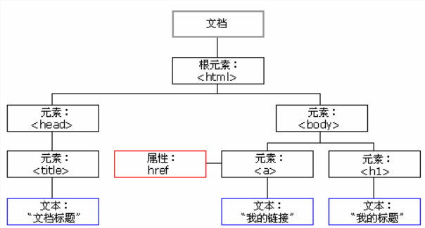

### JavaScript

- ##### 一、JS简介
  - JavaScript是脚本语言
    - JavaScript是一种轻量级的编程语言
    - JavaScript是可插入HTML页面的代码
    - JavaScript插入HTML页面后，可由现代所有浏览器执行

- ##### 二、JS实现
  - ###### 1、<script&gt;标签
    - 如果需要在HTML页面中插入JavaScript，需要使用<script&gt;标签。

    - <script&gt;和</script&gt;会告诉JavaScript何处开始和结束。

    - <script&gt;和</script&gt;之间包含了JavaScript：
          <script>
           alert("My First JavaScript");
          </script>

  - ###### 2、<body&gt;中的JavaScript
          <!DOCTYPE html>
          <html>
          <body>
          .
          .
          <script>
           document.write("<h1>This is a heading</h1>");
           document.write("<p>This is a paragraph</p>");
          </script>
          .
          .
          </body>
          </html>

  - ###### 3、<head&gt;中的JavaScript函数
          <!DOCTYPE html>
          <html>
          
          <head>
          <script>
          function myFunction()
          {
          document.getElementById("demo").innerHTML="My First JavaScript Function";
          }
          </script>
          </head>
          <body>
          <h1>My Web Page</h1>
          <p id="demo">A Paragraph</p>
          <button type="button" onclick="myFunction()">Try it</button>
          </body>
          </html>

  - ###### 4、<body&gt;中的JavaScript函数
          <!DOCTYPE html>
          <html>
          <body>
          
          <h1>My Web Page</h1>
          
          <p id="demo">A Paragraph</p>
          
          <button type="button" onclick="myFunction()">Try it</button>
          
          <script>
          function myFunction()
          {
          document.getElementById("demo").innerHTML="My First JavaScript Function";
          }
          </script>
          
          </body>
          </html>
          提示：我们把 JavaScript 放到了页面代码的底部，这样就可以确保在 <p> 元素创建之后再执行脚本。

  - ###### 5、外部的JavaScript

      - 也可以把脚本保存到外部文件中。外部的文件通常包含被多个网页使用的代码。
      - 外部JavaScript文件的文件扩展名是.js
      - 如需使用外部文件，需要在<script&gt;标签的src属性中设置该.js文件。

- ##### 三、JS输出

  - ###### 1、用于操作HTML元素

    - 若需从JavaScript访问某个HTML元素，可以使用document.getElementById('id')方法;需要使用'id'属性标识HTML元素

      ``` 
      !DOCTYPE html>
      <html>
      <body>

      <h1>我的第一张网页</h1>

      <p id="demo">我的第一个段落</p>

      <script>
      document.getElementById("demo").innerHTML="我的第一段 JavaScript";
      </script>

      </body>
      </html>
      ```

  - ###### 2、写到文档输出

    - 直接把p元素写到HTML文档中

      ```
      html>
      <body>

      <h1>我的第一张网页</h1>

      <script>
      document.write("<p>我的第一段 JavaScript</p>");
      </script>

      </body>
      </html>
      ```

  - ###### 3、注意

    - 使用document.write()仅仅向文档输出内容
    - 如果文档已完成加载后执行document.write，整个HTML页面将被覆盖

- ##### 四、JS语句

  - ###### 1、JavaScript语句

    - JS语句向浏览器发出的命令，语句的作用是告诉浏览器该做什么

      ```
      document.getElementById("demo").innerHTML="Hello World";
      上面的JavaScript语句向id="demo"的HTML元素输出文本"Hello World"
      ```

    - 分号

      - 分号用于分隔JavaScript语句
      - 通常在每条可执行的语句结尾添加分号
      - 使用分号的另一用处是在一行中编写多条语句

  - ###### 2、JavaScript代码

    - JavaScript代码是JavaScript语句的序列
    - 浏览器会按照编写顺序来执行每条语句

  - ###### 3、JavaScript代码块

    - JavaScript语句通过代码块的形式进行组合

    - 块由左花括号开始，由右花括号结束

    - 块的作用是使语句序列一起执行

      ```
      function myFunction()
      {
      document.getElementById("demo").innerHTML="Hello World";
      document.getElementById("myDIV").innerHTML="How are you?";
      }
      ```

  - ###### 4、JavaScript对大小写敏感

  - ###### 5、空格

    - JS会忽略多余的 空格。下面的两行代码是等效的

      ```
      var name="Hello";
      var name = "Hello";
      ```

  - ###### 6、对代码折行

    - 可以在文本字符串中使用反斜杠对代码进行换行

      ```
      document.write("Hello \
      World!");
      ```

- ##### 五、JS变量

  - ###### 1、变量是用来存储变量的容器

  - ###### 2、JavaScript变量

    - 变量名必须以字母开头
    - 可以以$和_符号开头(不推荐这样使用)
    - 对大小写敏感

  - ###### 3、声明(创建)JavaScript变量

    - 在JavaScript中创建变量通常称为声明变量

    - 使用var关键词来声明变量

      ```
      var carname;
      ```

    - 变量声明之后，该变量是空的，若需要赋值，使用等号

      ```
      carname="Volvo"
      ```

    - 也可以在声明变量时对其赋值

      ```
      var carname = "Volvo";
      ```

  - ###### 4 、一条语句，多个变量 

    - 可以在一条语句中声明很多变量。该语句以var开头，并使用逗号分隔变量即可：

      ```
      var name="xiaomi",age="180",gender="female";
      ```

    - 声明也可以横跨多行：

      ```
      var name="xiaomi",
      age="180",
      gender="female";
      ```

  - ###### 5、Value = undefined

    - 未赋值的声明的变量，值实际上是undefined。

      ```
      var carname;
      ```

  - ###### 6、重新声明JavaScript变量

    - 若重新声明JavaScript变量，该变量的值不会丢失

    - 下面两条语句执行后，变量carname的值依然是"volvo"

      ```
      var carname="Volvo";
      var carname;
      ```

- ##### 六、JS数据类型

  - ###### 字符串、数值、布尔、数组、对象、Null、Undefined

- ##### 七、JS对象

  - ###### JavaScript中的所有事物都是对象：字符串、数字、数组、日期等

  - ###### 在JavaScript，对象是拥有属性和方法的数据

  - ###### 属性和方法

    - 属性是与对象相关的值

    - 方法是能够在对象上执行的动作

    - 例如：汽车的属性

      ```
      car.name=Fiat

      car.model=500

      car.weight=850kg

      car.color=white 
      ```

    - 汽车的方法：

      ```
      car.start()

      car.drive()

      car.brake()
      ```

  - ###### JavaScript中的对象

    - 在JavaScript中，对象是数据(变量)，拥有属性和方法。
    - 在面向对象的语言中，属性和方法常被称为对象的成员

  - ###### 访问对象的属性

    - 访问对象属性的语法是：

      ```
      objectName.propertyName
      ```

  - ###### 访问对象的方法

    - 访问对象方法的语法

      ```
      objectName.methodName()
      ```

- ##### 八、JS函数

  - ###### 函数是由事件驱动的或者当它调用时执行的可重复使用的代码块

  - ###### JavaScript函数语法

    - 函数就是包裹在花括号中的代码块，前面使用了关键词function

      ```
      function functionname()
      {
      这里是要执行的代码
      }
      ```

    - 当调用该函数时，会执行函数内部的代码

    - JavaScript对大小写敏感。关键词function必须是小写的，并且必须以与函数名称相同大小写来调用函数

  - ###### 调用带参数的函数

    - 在调用函数时，可以像其传递值，这些值被称为参数

    - 这些参数可以在函数中使用

    - 可以发送任意个参数，由","分隔：

      ```
      myFunction(argument1,argument2)
      ```

- ##### 九、JS if...Else

  - ###### 条件语句用于基于不同的条件来执行不同的动作。

  - ###### 条件语句

    - **if语句** - 只用当指定条件为true时，使用该语句来执行代码
    - **if...else...** - 当条件为true时执行代码，当条件为false时执行其他代码
    - **if...else if...else语句** - 使用该语句来选择多个代码块之一来执行
    - **switch语句** - 使用该语句来选择多个代码块之一来执行

  - ###### if语句

    - 只有当指定条件为true时，该语句才会执行代码

    - 语法

      ```
      if (条件)
        {
        只有当条件为 true 时执行的代码
        }
      ```

    - **注意：**使用小写的 if

  - ###### if...else语句

    - 使用if....else语句在条件为true时执行代码，在条件为false时执行其他代码

    - 语法

      ```
      if (条件)
        {
        当条件为 true 时执行的代码
        }
      else
        {
        当条件不为 true 时执行的代码
        }
      ```

  - ###### if...else if ...else语句

    - 使用if...else if ...else语句来选择多个代码块之一来执行

    - 语法

      ```
      f (条件 1)
        {
        当条件 1 为 true 时执行的代码
        }
      else if (条件 2)
        {
        当条件 2 为 true 时执行的代码
        }
      else
        {
        当条件 1 和 条件 2 都不为 true 时执行的代码
        }
      ```

- ##### 十、JS  Switch

  - ###### 使用switch语句来选择要执行的多个代码之一

    - 语法

      ```
      switch(n)
      {
      case 1:
        执行代码块 1
        break;
      case 2:
        执行代码块 2
        break;
      default:
        n 与 case 1 和 case 2 不同时执行的代码
      }
      工作原理：首先设置表达式n(通常是一个变量)。随后表达式的值会与结构中的每个case的值做比较。如果存在匹配，则与该case关联的代码会被执行。使用break来组织代码自动地向下运行。
      ```

    - 实例：显示今日的名称。需要注意：Sunday = 0, Monday = 1,Tuesday = 2，

      ```
      switch (day)
      {
      case 0:
        x="Today it's Sunday";
        break;
      case 1:
        x="Today it's Monday";
        break;
      case 2:
        x="Today it's Tuesday";
        break;
      case 3:
        x="Today it's Wednesday";
        break;
      case 4:
        x="Today it's Thursday";
        break;
      case 5:
        x="Today it's Friday";
        break;
      case 6:
        x="Today it's Saturday";
        break;
      }
      ```

  - ###### default关键词

    - 使用关键词来规定匹配不存在时做的事情

    - 实例：如果今天不是周六或周日，则会输出默认的消息

      ```
      var day=new Date().getDay();
      switch (day)
      {
      case 6:
        x="Today it's Saturday";
        break;
      case 0:
        x="Today it's Sunday";
        break;
      default:
        x="Looking forward to the Weekend";
      }
      ```

- ##### 十一、JS For

  - ###### 循环可以将代码块执行指定的次数


  - ###### 不同类型的循环

    - **for** - 循环代码块一定的次数
    - **for/in** - 循环遍历对象的属性
    - **while** - 当指定的条件为true时循环指定的代码块
    - **do/while** - 同样当指定的条件为true时循环指定的代码

  - ###### For循环

    - for循环语法：

      ```
      for (语句 1; 语句 2; 语句 3)
        {
        被执行的代码块
        }
      语句 1 在循环（代码块）开始前执行

      语句 2 定义运行循环（代码块）的条件

      语句 3 在循环（代码块）已被执行之后执行
      ```

  - ###### For/In循环

    - for/in语句循环遍历对象的属性

    - 例子

      ```
      var person={fname:"John",lname:"Doe",age:25};

      for (x in person)
        {
        txt=txt + person[x];
        }
      ```

- ##### 十二、JS While

  - ###### while循环

    - while循环会在指定条件为真时循环执行代码块

    - 语法：

      ```
      while (条件)
        {
        需要执行的代码
        }
      ```

    - 实例

      ```
      while (i<5)
        {
        x=x + "The number is " + i + "<br>";
        i++;
        }
      ```

  - ###### do/while 循环

    - do/while循环是while循环的变体。该循环会执行一次代码块，在检查条件是否为真，如果条件为真的话，继续重复这个循环

    - 语法

      ```
      do
        {
        需要执行的代码
        }
      while (条件);
      ```

      ​

- ##### 十二、JS break

  - ###### break 语句用于跳出循环

    - break语句跳出循环后，会执行该循环之后的代码

      ```
      for (i=0;i<10;i++)
        {
        if (i==3) break;
        x=x + "The number is " + i + "<br>";
        }
      ```

  - ###### continue用于跳过循环中的一个迭代

    - continue语句中断循环中的迭代，如果出现了指定的条件，然后继续循环中的下一个迭代。

- ##### 十三、JS错误 

  - ###### ***try*** 语句测试代码块的错误

    - ***try*** 语句允许定义在执行时进行进行错误测试的代码块

  - ###### ***catch*** 语句处理错误

    - ***catch*** 语句允许定义当try代码块发生错误时，所执行的代码块

    - JavaScript语句**try**和**catch**是成对出现的

    - **语法**

      ```
      {
        //在这里运行代码
        }
      catch(err)
        {
        //在这里处理错误
        }
      ```

    - **实例** ：catch块捕捉try块中的错误，并执行代码来处理它。

      ```
      <html>
      <head>
      <script>
      var txt="";
      function message()
      {
      try
        {
        adddlert("Welcome guest!");
        }
      catch(err)
        {
        txt="There was an error on this page.\n\n";
        txt+="Error description: " + err.message + "\n\n";
        txt+="Click OK to continue.\n\n";
        alert(txt);
        }
      }
      </script>
      </head>

      <body>
      <input type="button" value="View message" onclick="message()">
      </body>

      </html>
      ```

  - ###### *throw* 语句创建自定义错误

    - **throw**语句允许创建自定义错误

    - 正确的技术术语是：创建或***抛出异常***。

    - 如果把***throw***与***try***和***catch***一起使用，那么能够控制程序流，并生成自定义的错误

    - 语法

      ```
      throw exception
      ```


***************************************************

###                      JS HTML

- ##### 一、DOM简介

  - **HTML DOM (文档对象模型)**

    - 当网页被加载时，浏览器会创建页面的文档对象模型(Document Object Model)
    - HTML DOM模型被构造为对象的树

  - **HTML DOM树**

    

    - 通过可编程的对象模型，JavaScript获得了足够的能力创建动态的HTML
      - JavaScript能够改变页面中的所有HTML元素
      - JavaScript能够改变页面中的所有HTML属性
      - JavaScript能改变页面中的所有CSS样式
      - JavaScript能够对页面中的所有事件做出反应

  - **查找HTML元素**

    - 通常，通过JavaScript，需要操作HTML元素。

    - 通过id查找HTML元素

      ```
      var x=document.getElementById("intro");
      ```

    - 通过标签名找到HTML元素

    - 通过类名找到HTML元素

- ##### 二、DOM HTML

  - ***改变HTML内容***

    - 语法

      ```
      document.getElementById(id).innerHTML=new HTML
      ```

  - ***改变HTML属性***

    - 语法

      ```
      document.getElementById(id).attribute=new value
      ```

- ##### 三、DOM CSS

  - ***改变HTML样式***

    - 语法

      ```
      document.getElementById(id).style.property=new style
      ```

- ##### 四、DOM事件

  - ***对事件作出反应***

    - 可以在事件发生时执行JavaScript，比如当用户在HTNL元素上点击时
    - HTML事件的例子：
      - 当用户点击鼠标时
      - 当网页加载时
      - 当图像已加载时
      - 当鼠标移动到元素上时
      - 当输入字段被改变时
      - 当提交HTML表单时
      - 当用户触发按键时

  - ***HTML事件属性***

    - 如需向HTML元素分配事件，可以使用事件属性

    - 例：向button元素分配onclick事件

      ```
      <button onclick="displayDate()">点击这里</button>
      ```

  - ***onload和onunload事件***

    - onload和onunload事件会在用户进入或离开页面时被触发。
    - onload事件可用于检测访问者的浏览器类型版本，并基于这些信息来加载网页的正确版本。
    - onload和onunload事件可用于处理cookie

  - ***onchange事件***

    - onchange事件常结合对输入的字段的验证来使用。

    - 实例

      ```
      <input type="text" id="fname" onchange="upperCase()">
      ```

  - ***onmouseover和onmouseout事件***

    - onmouseover和onmouseout事件可用于在用户的鼠标移至HTML元素上方或移除元素时触发函数

  - **onmousedown、onmouseup以及onclick事件**

    - onmousedown, onmouseup 以及 onclick 构成了鼠标点击事件的所有部分。
    - 首先当点击鼠标按钮时，会触发 onmousedown 事件，当释放鼠标按钮时，会触发 onmouseup 事件，最后，当完成鼠标点击时，会触发 onclick 事件。

- ##### 五、DOM元素(节点)

  - ***创建新的HTML元素***

    - 创建新的的<p &gt;元素

      ```
      var para=document.createElement("p");
      ```

    - 向<p&gt;元素添加文本之前，先创建文本节点。

      ```
      var node=document.createTextNode("这是新段落。");
      ```

    - 向&lt;p>元素追加这个文本节点

      ```
      para.appendChild(node);
      ```

    - 然后将<p&gt;元素追加到一个div元素中

      ```
      var element=document.getElementById("div1");
      element.appendChild(para);
      ```

  - ***删除已有的HTML元素***

    - 若要删除HTML元素，首先要获得该元素的父元素

      ```
      <div id="div1">
      <p id="p1">这是一个段落。</p>
      <p id="p2">这是另一个段落。</p>
      </div>

      <script>
      var parent=document.getElementById("div1");
      var child=document.getElementById("p1");
      parent.removeChild(child);
      </script>
      ```

    - 当然也可以不引用父元素，可以使用parentNode属性来找到父元素

      ```
      var child=document.getElementById("p1");
      child.parentNode.removeChild(child);
      ```

      ​

## JS对象

- ##### 一、JS对象

  - **JavaScript对象**
    - JavaScript提供多个内建对象，比如***String、Date、Array***
    - 对象只是带有**属性**和**方法**的特殊数据类型。

  - **访问对象的属性**

    - 属性是与对象相关的值

    - 访问对象属性的语法是：

      ```
      objectName.propertyName
      ```

    - 这个例子使用了**String**对象的length属性来获得字符串的长度：

      ```
      var message="Hello World!";
      var x=message.length;
      ```

  - **访问对象的方法**

    - 方法是能够在对象上执行的动作。

    - 调用方法的语法

      ```
      objectName.methodName()
      ```

    - 下面使用了**String**对象的toUpperCase()方法来将文本转换成大写：

      ```
      var message="Hello world!";
      var x=message.toUpperCase();
      ```

  - **创建JavaScript对象**

    - 通过**JavaScript**,创建自己的对象。
    - 创建新对象有两种不同的方法：
      - 1、定义并创建对象的实例
      - 2、使用函数来定义对象，然后创建新的对象实例

  - **创建直接的实例**

    - 这个例子创建了对象的一个新实例，并向其添加了四个属性：

      ```
      person = new Object();
      person.firstName = "xiongda";
      person.lastName = "xionger";
      person.age = 2;
      person.gender = male;
      ```

  - **使用对象构造器**

    ```
    function person(firstnme,lastname,age,gender)
    {
      this.firstname = firstname;
      this.lastname = lastname;
      this.age = age;
      this.gender = gender;
    }
    ```

  - **创建JavaScript对象实例**

    ```
    var student = new person("xiaohong","erhong",12,"female");
    var teacher = new person("aa","bb",25,"female");
    ```

  - **把属性加到JavaScript对象**

    - 可以通过为对象赋值，向已有对象添加新属性

      ```
      假设personObj已存在，可以为其添加新属性；例如：
      person.name = "xiaoming";
      person.age = 16;
      persosn.gender = "男";
      ```

  - **把方法添加到JavaScript对象**

    - 方法是附加在对象上的函数

    - 在构造器函数内部定义对象的方法

      ```
      function person(name,age,gender,hobby){
        this.name = name;
        this.age = age;
        this.gender = gender;
        this.hobby = hobby;
        this.sayHi = function(){
          alert("hello,my name is " + this.name)
        }
      }
      ```

  - **JavaScript类**

    - JavaScript是面向对象的语言，但JavaScript不使用类
    - 在JavaScript中，不会创建类，也不会通过类来创建对象
    - JavaScript基于prototype，而不是基于类的

  - **JavaScript For ... in 循环**

    - JavaScript for....in循环遍历对象属性

    - 语法

      ```
      for (对象中的变量)
        {
        要执行的代码
        }
      ```

    - 注释：for...in循环中的代码块针对每个属性只执行一次

    - 实例

      - 循环遍历对象的属性

        ```
        var person = {name:"小明",age:18,gender:"男"};
        for (x in person){
          txt = txt + preson[x];
        }
        ```


- ##### 二、JS数字

  - **数字属性和方法**
    - 属性：
      - MAX VALUE
      - MIN VALUE
      - NEGATIVE INFINITIVE
      - POSITIVE INFINITIVE
      - NaN
      - prototype
      - constructor
    - 方法
      - toExponential()
      - foFiexed()
      - toPrecision()
      - toString()
      - valueOf()

- ##### 三、JS字符串

  - **String对象用于处理已有的字符快。**
  - **JavaScript String对象 实例**
    - 计算字符串的长度(通过***length*** 属性)
    - 为字符串添加样式(通过字符串的一些方法)
    - indexOf()方法(查找字符串中某个指定的字符首次出现的位置，返回的是其索引；若找不大则返回-1)
    - match()方法(匹配字符串中的字符，找到返回该字符；找不到返回null)
    - replace()方法(str.replace('需要替换掉的','需要替换成为的'))

- ##### 四、JS日期

  - **JavaScript Date对象 实例**
    - 返回当日的日期和时间 ———— 使用***Date()***方法获得当日的日期
    - ***getTime()*** ———— 返回从1970年1月1日至今的毫秒数
    - ***setFullYear()*** ———— 设置具体的日期
    - ***toUTCString()*** ———— 将当日的日期转换为字符串
    - ***getDay()*** ———— 获取某一天


  - **定义日期**

    - ***Date***对象用于处理日期和时间

    - 通过***new***关键词来定义***Date***对象。

      ```
      var myDate = new Date()
      ```

  - **操作日期**

    - 为日期对象设置一个特定的日期

      ```
      var myDate = new Date()
      myDate.setFullYear(2017,11,25)
      ```

    - ***注意：表示月份的参数介于0到11之间，如果希望把月份设置为12月，则参数应该是11***

  - **比较日期**

    - 日期对象也可用于比较两个日期

    - 下面的代码将当期日期与2017年12月25日做了比较

      ```
      var myDate = new Date();
      myDate.setFullYear(2017,11,25);
      var today = new Date();
      if(myDate > today)
      {
        alert("圣诞节还没到呢")
      }else{
        alert("圣诞节过去了")
      }
      ```

- ##### 五、JS数组

  - **实例**

    - *创建数组*

      - 两种方法

        ```
        var arr = [];
        var arr = new Array(0)
        ```

    - *For ...In声明*

      - 使用for...in声明来循环输出数组中的元素

        ```
        for(key in ArrayName)
        ```

    - *合并两个数组 - concat*

      - 用来合并两个数组

        ```
        var arr1 = new Array(3);
        var arr2 = new Array(2);
        arr1.concat(arr2)
        ```

    - *用数组的元素组成字符串 - join()*

      - 使用join()方法将数组的所有元素组成一个字符串

        ```
        var arr = [1,2,3,4];
        arr.join(); //默认是逗号
        arr.join('|');//是以|分隔
        ```

    - *文字数组 - sort()*

      - 从字面上对数组进行排序

        ```
        var arr = [b,c,a,f,d];
        var arr2 = arr.sort;
        arr2 = [a,b,c,d,f]
        ```

    - *数字数组 - sort()*

      - 从数值上对数组进行排序

        ```
        function sortNumber(a,b){
          return a - b
        }
        var arr = [1,7,5,3,4,6];
        var arr2 = arr.sort(sortNumber);
        arr2 = [1,3,4,5,6,7]
        ```

  - ***定义数组***

    - 使用***new***来创建数组对象

      ```
      var arr = new Array()
      ```

    - 有两种向数组赋值的方法

    - 第一种

      ```
      var cars = new Array();
      cars[0] = "Saab";
      cars[1] = "Volvo";
      cars[2] = "BMW";

      也可以用一个整数自变量控制数组的容量
      var cars = new Arry(3)
      cars[0] = "Saab";
      cars[1] = "Volvo";
      cars[2] = "BMW";
      ```

    - 第二种

      ```
      var cars = new Array("Saab","Volvo","BMW");
      ```

  - ***访问数组***

  - ***修改数组中的值***

    - 修改数组中的值，只要向指定下标号添加一个新值即可

      ```
      cars[0] = "Opel"
      ```

- ##### 六、JS逻辑

  - **Booleans对象用于将非逻辑值转换为逻辑值**(true或false)

  - **Boolean 对象**

    - 可以将Bool额按对象理解为一个产生逻辑指的对象包装器
    - Boolean对象用于将非逻辑值转换为逻辑值(true或false)

  - **创建Boolean对象**

    - 使用关键词***new***来定义***Boolean***对象。

      ```
      var myBoolean = new Boolean()
      ```

    - 若逻辑对象五初始值0、-0、null、""、false、undefined、NaN，则对象的值为false；否则对象值为true

- ##### 七、JS算数

  - **算数值**
    - JavaScript提供8种可被Math对象访问的算数值：
      - ***常数***
      - ***圆周率***
      - ***2的平方根***
      - ***1/2的平方根***
      - ***2的自然对数***
      - ***10的自然对数***
      - ***以2为底的e的对数***
      - ***以10为底的e的对数***
    - 在JavaScript中使用这些值的方法(与上面的算数值一一对应)
      - **Math.E**
      - **Math.PI**
      - **Math.SQRT2**
      - **Math.SQRT1_2**
      - **Math.LN2**
      - **Math.LN10**
      - **Mathe.LOG2E**
      - **Math.LOG10E**

  - **算数方法**

    - round()  ———— 四舍五入

      ```
      Math.round(0.60)   //1
      Math.round(0.50)   //1
      Math.round(0.49)   //0
      Math.round(-4.40)  //-4
      Math.round(-4.60)  //-5
      ```

    - random()  ———— 返回0到之间的随机数

      ```
      Math.random()
      ```

    - max() ———— 返回两个给定的数中的随机数

      ```
      Math.max(5,7)  // 7
      Math.max(-5,-7) // -5
      Math.max(-5,7)  // 7
      Math.max(5.5,7.2) //7.2
      ```

- ##### 八、JS正则表达式

  - **RegExp**

    - ***RegExp***是正则表达式的缩写。

  - **定义Regexp**

    - ***RegExp***对象用于存储检索模式

    - 通过 ***new***关键词来定义***RegExp***对象。

      ```
      var patt1=new RegExp("e");
      当使用RegExp对象在一个字符串中检索时，将寻找的是字符"e"
      ```

  - **RegExp对象的方法**

    - ***RegExp***对象有3个方法：test()、exec()、compile()。

    - ***test()***

      - test()方法检索字符串中的指定值。返回值是true或false。

        ```
        var patt1=new RegExp("e");

        document.write(patt1.test("The best things in life are free")); 
        返回值是true
        ```

    - ***exec()***

      - exec()方法检索字符串中的指定值。返回值是被找到的值。如果没有发现匹配，则返回null

        ```
        var patt1=new RegExp("e");

        document.write(patt1.exec("The best things in life are free"));
        返回值是e
        ```

      - 可以向***RegExp***对象添加第二个参数，以设定检索。

      - 使用g全局参数(global)

        - 找到第一个"e",并存储其位置

        - 再次运行exec(),则从存储位置开始检索，并找到下一个"e",并存储其位置

          ```
          var patt1=new RegExp("e","g");
          do
          {
          result=patt1.exec("The best things in life are free");
          document.write(result);
          }
          while (result!=null)
          返回值是eeeeeenull
          ```

    - ***compile()***

      - compile()方法用于改变*RegExp*。

      - compile()既可以改变检索模式，也可以添加或删除第二个参数

        ```
        var patt1=new RegExp("e");

        document.write(patt1.test("The best things in life are free"));

        patt1.compile("d");

        document.write(patt1.test("The best things in life are free"));
        //由于字符串中存在"e",没有"d"
        //则输出truefalse
        ```


## JS Window

- ##### 一、JS Window

  - **浏览器对象模型(BOM)使JavaScript有能力与浏览器对话**

  - **浏览器对象模型(BOM)**

    - 浏览器对象模型(***Browser Object Model***)
    - 由于浏览器几乎实现了JavaScript交互性方面的相同方法和属性，因此被认为BOM的方法和属性

  - **Window对象**

    - 所有浏览器都支持***window***对象。它表示浏览器窗口。

    - 所有的***JavaScript***全局对象、函数以及变量均自动成为***window***对象的成员

    - 全局变量是***window***对象的属性。

    - 全局函数是***window***对象的方法。

    - ***HTML DOM*** 的***document***也是***window***对象的属性。

      ```
      window.document.getElementById("header");
      document.getElementById("header")
      ```

  - **Window尺寸**

    - 有三种方法能够确定浏览器窗口的尺寸(浏览器的视口，不包括工具栏和滚动条)

    - 对于***IE、Chrome、Firefox、Opera、Safari***

      - ***window.innerHeight*** ———— 浏览器窗口的内部高度
      - ***window.innerWidth*** ———— 浏览器窗口的内部宽度

    - 对于***IE5、6、7、8***

      - ***document.documentElement.clientHeight***
      - ***document.documentElement.clientWidth***

    - 或者

      - ***document.body.clientHeight***
      - ***document.body.clientWidth***

    - 实用的JavaScript方案(包括所有浏览器)：

      ```
      var h = window.innerheight
      || document.documentElement.clientHeight
      || document.body.clientHeight;

      var w = window.innerWidth
      || document.documentElement.clientWidth
      || document.body.clientWidth

      ```

  - **其他Window方法**

    - ***window.open()*** —— 打开新窗口
    - ***window.close()*** —— 关闭当前窗口
    - ***window.moveTo*** —— 移动当前窗口
    - ***window.resizeTo*** —— 调整当前窗口尺寸

- ##### 二、JS Screen

  - **Window Screen**
    - ***window.screen***对象在编写时可以不使用***window***这个前缀
    - 一些属性;
      - ***screen.availWidth*** —— 可用屏幕宽度
      - ***screen.availHeight***——可用屏幕高度
  - **Window Screen 可用宽度**
    - ***screen.availWidth***属性返回访问者屏幕的宽度
  - **Window Screen 可用高度**
    - ***screen.availHeight***属性返回访问者屏幕的高度

- ##### 三、JS Location

  - **Window Location**
    - ***window.location***对象在编写时可不使用window这个前缀
    - 例子
      - ***location.hostname***   —— 返回web主机的域名
      - ***location.pathname*** ——返回当前页面的路径和文件名
      - ***location.port*** —— 返回web主机的端口
      - ***location.protocol*** ——返回所使用的web协议(http:// 或 https:)
  - **Window Location Href**
    - ***location.href***属性返回当前页面的 ***URL***
  - **Window Location Pathname**
    - ***location.pathname*** 属性返回***URL***的路径名。
  - **Window Location Assign**
    - ***location.assign()***方法加载新的文档

- ##### 四、JS History

  - **Window History**
    - ***window.history***对象在编写时可不使用***window***这个前缀
    - 为了保护用户隐私，对JavaScript访问对象的方法做出了限制。
    - 一些方法：
      - ***history.back()***  —— 与浏览器点击后退按钮相同
      - ***history.forward()*** —— 与浏览器中点击按钮向前相同
  - **Window History Back**
    - ***history.back()***方法加载历史列表中的前一个***URL***
    - 这与浏览器中点击后退按钮时相同的
  - **Window History Forward**
    - ***history forward()*** 方法加载历史列表中下一个***URL***
    - 这与在浏览器中点击前进按钮事是相同的

- ##### 五、JS Navigator

  - **Window Navigator**
    - ***window.navigator***对象在编写时可不使用***window***这个前缀
    - ***警告：***来自***navigator*** 对象的信息具有误导性，不应该被用于检测浏览器版本，这是因为
      - ***navigator***数据可被浏览器使用者更改
      - 浏览器无法报告晚于浏览器发布的新操作系统
  - **浏览器检测**
    - 由于***navigator***可误导浏览器检测，使用对象检测可用来嗅探不同的浏览器
    - 由于不同的浏览器支持不同的对象，可以使用对象来检测浏览器

- ##### 六、JS PopupAlert

- ##### 七、JS Timing

- ##### 八、JS Cooikes

  - **Cooike用来识别用户**

  - **什么是cookie?**

    - ***cooike***是存储于访问者的计算机中的变量。每当同一台计算机通过浏览器请求某个页面时，就会发送这个***cooike***

  - **创建和存储cooike**

    ```
    function setCookie(c_name,value,expiredays)
    {
      var exdate = new Date()
      esdate.setDate(exdate.getDate()+expiredays)
      document.cooike = c_name + "=" + escape(value)+((espiredays == null) ? "":";espires="exdate.toGMTString())
    }
    //上面这个函数中的参数存有cooike的名称、值以及过期天数
    ```

    ​